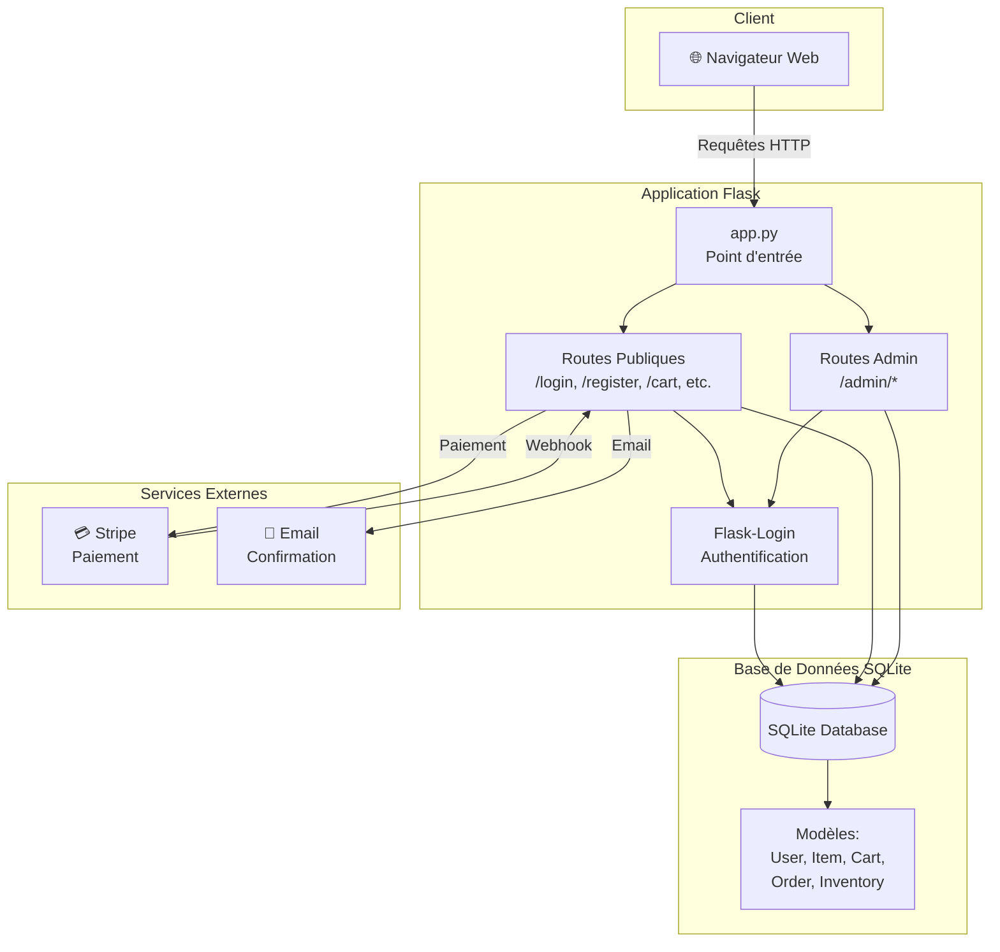
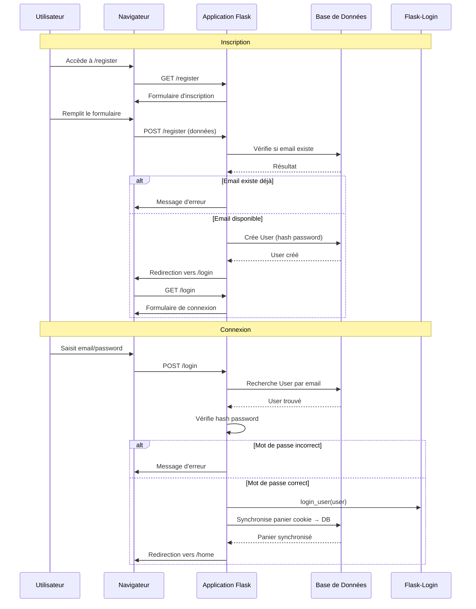
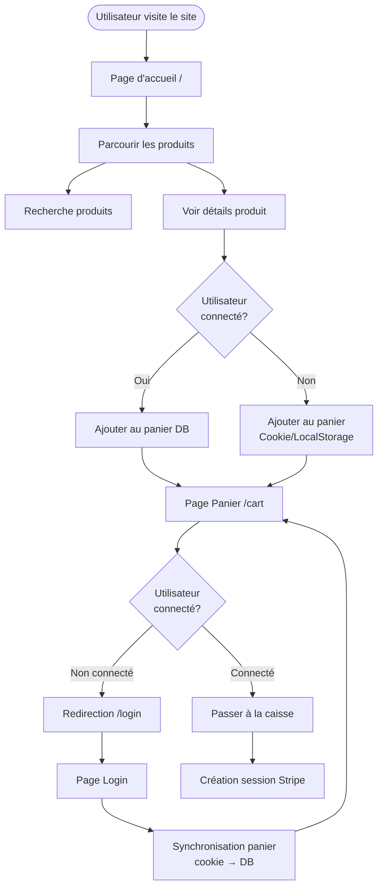
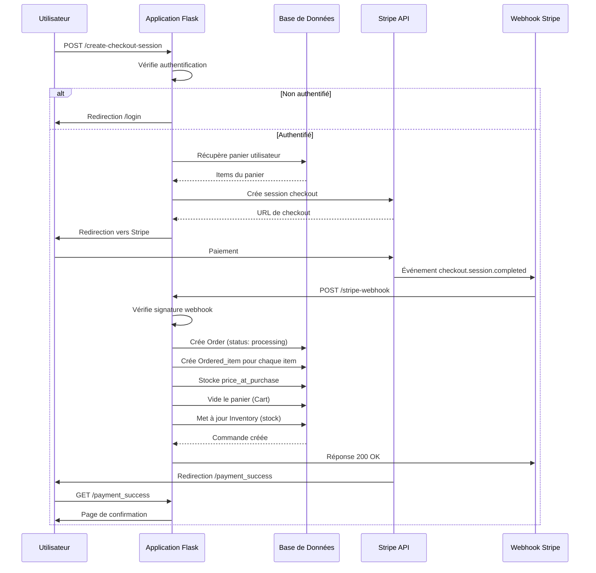
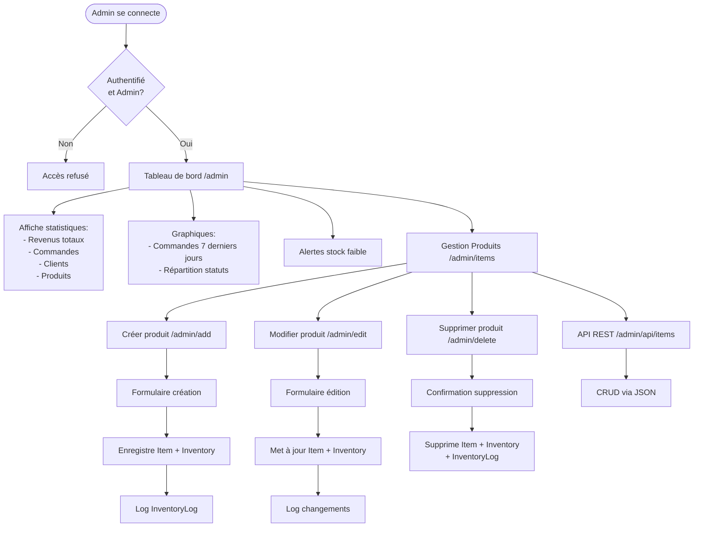
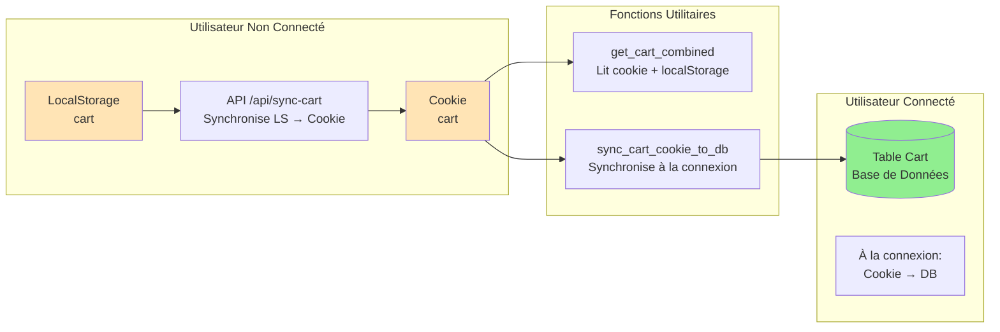
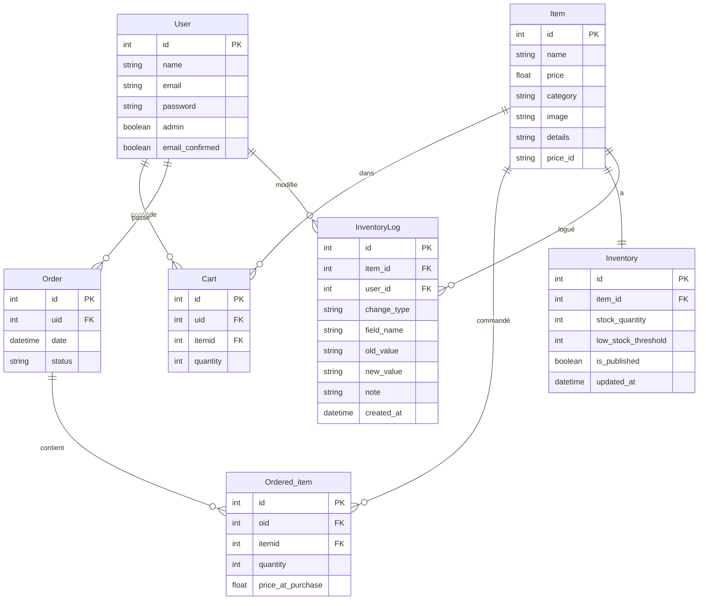
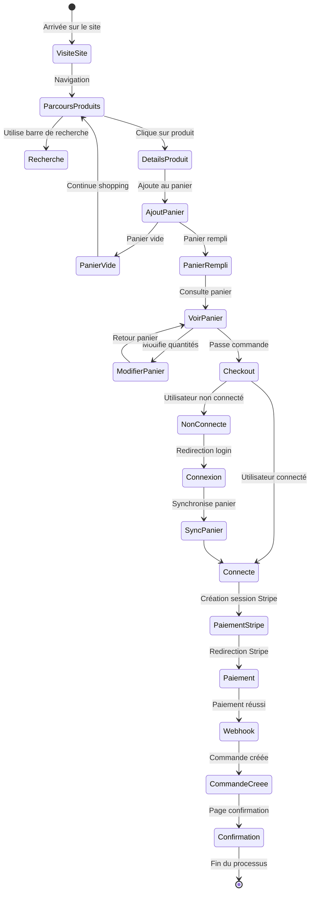
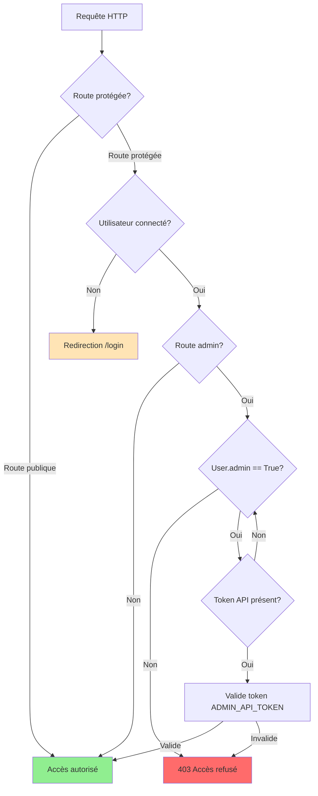
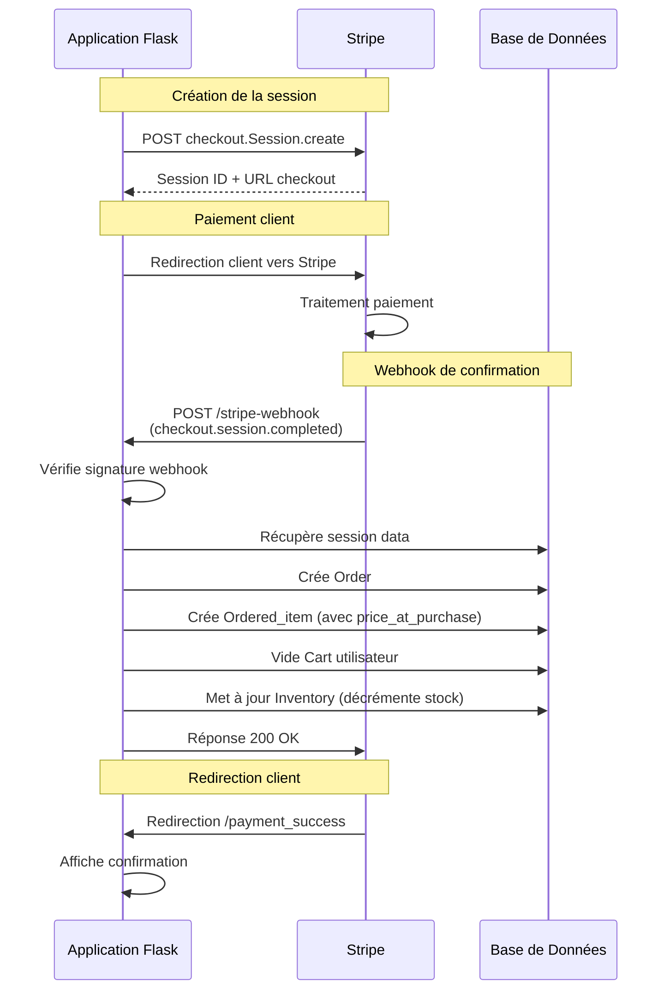

# Diagramme de Fonctionnement - Fnuc Marty SA

Ce document présente les diagrammes de fonctionnement de la plateforme e-commerce Fnuc Marty SA développée avec Flask.

## Architecture Générale

## Flux Utilisateur - Authentification

## Flux Utilisateur - Navigation et Panier

## Flux Utilisateur - Processus de Commande

## Flux Administrateur - Gestion des Produits

## Gestion du Panier - Architecture Multi-Support

## Modèle de Données - Relations

## Flux Complet - Parcours Client

## Sécurité et Authentification

## Intégration Stripe - Webhook

## Fonctionnalités Principales

### ✅ Fonctionnalités Implémentées

1. **Authentification Utilisateur**
   - Inscription avec hash de mot de passe
   - Connexion avec Flask-Login
   - Gestion de session

2. **Gestion du Panier**
   - Panier en base de données (utilisateurs connectés)
   - Panier via cookies/localStorage (non connectés)
   - Synchronisation automatique à la connexion

3. **Paiement en Ligne**
   - Intégration Stripe Checkout
   - Webhook pour confirmation de paiement
   - Gestion des prix historiques (price_at_purchase)

4. **Interface Administrateur**
   - Tableau de bord avec statistiques
   - Graphiques (Chart.js)
   - Gestion CRUD des produits
   - Gestion de l'inventaire avec logs
   - Alertes stock faible
   - Export CSV

5. **Recherche**
   - Barre de recherche pour les produits

6. **Interface Responsive**
   - Bootstrap pour le design
   - Compatible desktop et mobile

### 🔄 En Développement

- Multi-plateforme (desktop + mobile)
- Déploiement Azure
- Backend administrateur complet (partiellement fait)

---

*Document généré à partir de la documentation du projet et de l'analyse du code source.*

