# Diagramme de Fonctionnement - Fnuc Marty SA

Ce document présente les diagrammes de fonctionnement de la plateforme e-commerce Fnuc Marty SA développée avec Flask.

## Architecture Générale

```mermaid
graph TB
    subgraph "Client"
        Browser[🌐 Navigateur Web]
    end
    
    subgraph "Application Flask"
        App[app.py<br/>Point d'entrée]
        Routes[Routes Publiques<br/>/login, /register, /cart, etc.]
        AdminRoutes[Routes Admin<br/>/admin/*]
        Auth[Flask-Login<br/>Authentification]
    end
    
    subgraph "Base de Données SQLite"
        DB[(SQLite Database)]
        Models[Modèles:<br/>User, Item, Cart,<br/>Order, Inventory]
    end
    
    subgraph "Services Externes"
        Stripe[💳 Stripe<br/>Paiement]
        Email[📧 Email<br/>Confirmation]
    end
    
    Browser -->|Requêtes HTTP| App
    App --> Routes
    App --> AdminRoutes
    Routes --> Auth
    AdminRoutes --> Auth
    Auth --> DB
    Routes --> DB
    AdminRoutes --> DB
    DB --> Models
    Routes -->|Paiement| Stripe
    Stripe -->|Webhook| Routes
    Routes -->|Email| Email
```

## Flux Utilisateur - Authentification

```mermaid
sequenceDiagram
    participant U as Utilisateur
    participant B as Navigateur
    participant App as Application Flask
    participant DB as Base de Données
    participant Auth as Flask-Login

    Note over U,Auth: Inscription
    U->>B: Accède à /register
    B->>App: GET /register
    App->>B: Formulaire d'inscription
    U->>B: Remplit le formulaire
    B->>App: POST /register (données)
    App->>DB: Vérifie si email existe
    DB-->>App: Résultat
    alt Email existe déjà
        App->>B: Message d'erreur
    else Email disponible
        App->>DB: Crée User (hash password)
        DB-->>App: User créé
        App->>B: Redirection vers /login
        B->>App: GET /login
        App->>B: Formulaire de connexion
    end

    Note over U,Auth: Connexion
    U->>B: Saisit email/password
    B->>App: POST /login
    App->>DB: Recherche User par email
    DB-->>App: User trouvé
    App->>App: Vérifie hash password
    alt Mot de passe incorrect
        App->>B: Message d'erreur
    else Mot de passe correct
        App->>Auth: login_user(user)
        App->>DB: Synchronise panier cookie → DB
        DB-->>App: Panier synchronisé
        App->>B: Redirection vers /home
    end
```

## Flux Utilisateur - Navigation et Panier

```mermaid
flowchart TD
    Start([Utilisateur visite le site]) --> Home[Page d'accueil /]
    Home --> Browse[Parcourir les produits]
    Browse --> Search[Recherche produits]
    Browse --> ViewItem[Voir détails produit]
    
    ViewItem --> AddCart{Utilisateur<br/>connecté?}
    
    AddCart -->|Oui| AddDB[Ajouter au panier DB]
    AddCart -->|Non| AddCookie[Ajouter au panier<br/>Cookie/LocalStorage]
    
    AddDB --> CartPage[Page Panier /cart]
    AddCookie --> CartPage
    
    CartPage --> CheckAuth{Utilisateur<br/>connecté?}
    
    CheckAuth -->|Non connecté| LoginReq[Redirection /login]
    CheckAuth -->|Connecté| Checkout[Passer à la caisse]
    
    LoginReq --> Login[Page Login]
    Login --> SyncCart[Synchronisation panier<br/>cookie → DB]
    SyncCart --> CartPage
    
    Checkout --> StripeCheckout[Création session Stripe]
```

## Flux Utilisateur - Processus de Commande

```mermaid
sequenceDiagram
    participant U as Utilisateur
    participant App as Application Flask
    participant DB as Base de Données
    participant Stripe as Stripe API
    participant Webhook as Webhook Stripe

    U->>App: POST /create-checkout-session
    App->>App: Vérifie authentification
    alt Non authentifié
        App->>U: Redirection /login
    else Authentifié
        App->>DB: Récupère panier utilisateur
        DB-->>App: Items du panier
        App->>Stripe: Crée session checkout
        Stripe-->>App: URL de checkout
        App->>U: Redirection vers Stripe
        U->>Stripe: Paiement
        Stripe->>Webhook: Événement checkout.session.completed
        Webhook->>App: POST /stripe-webhook
        App->>App: Vérifie signature webhook
        App->>DB: Crée Order (status: processing)
        App->>DB: Crée Ordered_item pour chaque item
        App->>DB: Stocke price_at_purchase
        App->>DB: Vide le panier (Cart)
        App->>DB: Met à jour Inventory (stock)
        DB-->>App: Commande créée
        App->>Webhook: Réponse 200 OK
        Stripe->>U: Redirection /payment_success
        U->>App: GET /payment_success
        App->>U: Page de confirmation
    end
```

## Flux Administrateur - Gestion des Produits

```mermaid
flowchart TD
    Start([Admin se connecte]) --> Auth{Authentifié<br/>et Admin?}
    Auth -->|Non| Denied[Accès refusé]
    Auth -->|Oui| Dashboard[Tableau de bord /admin]
    
    Dashboard --> Stats[Affiche statistiques:<br/>- Revenus totaux<br/>- Commandes<br/>- Clients<br/>- Produits]
    Dashboard --> Charts[Graphiques:<br/>- Commandes 7 derniers jours<br/>- Répartition statuts]
    Dashboard --> LowStock[Alertes stock faible]
    
    Dashboard --> Items[Gestion Produits /admin/items]
    Items --> Add[Créer produit /admin/add]
    Items --> Edit[Modifier produit /admin/edit]
    Items --> Delete[Supprimer produit /admin/delete]
    
    Add --> FormAdd[Formulaire création]
    FormAdd --> SaveAdd[Enregistre Item + Inventory]
    SaveAdd --> LogAdd[Log InventoryLog]
    
    Edit --> FormEdit[Formulaire édition]
    FormEdit --> SaveEdit[Met à jour Item + Inventory]
    SaveEdit --> LogEdit[Log changements]
    
    Delete --> Confirm[Confirmation suppression]
    Confirm --> DelDB[Supprime Item + Inventory<br/>+ InventoryLog]
    
    Items --> API[API REST /admin/api/items]
    API --> CRUD[CRUD via JSON]
```

## Gestion du Panier - Architecture Multi-Support

```mermaid
graph LR
    subgraph "Utilisateur Non Connecté"
        Cookie[Cookie<br/>cart]
        LocalStorage[LocalStorage<br/>cart]
        SyncLS[API /api/sync-cart<br/>Synchronise LS → Cookie]
    end
    
    subgraph "Utilisateur Connecté"
        DBCart[(Table Cart<br/>Base de Données)]
        SyncCookie[À la connexion:<br/>Cookie → DB]
    end
    
    subgraph "Fonctions Utilitaires"
        GetCart[get_cart_combined<br/>Lit cookie + localStorage]
        SyncFunc[sync_cart_cookie_to_db<br/>Synchronise à la connexion]
    end
    
    Cookie --> GetCart
    LocalStorage --> SyncLS
    SyncLS --> Cookie
    Cookie --> SyncFunc
    SyncFunc --> DBCart
    
    style DBCart fill:#90EE90
    style Cookie fill:#FFE4B5
    style LocalStorage fill:#FFE4B5
```

## Modèle de Données - Relations

```mermaid
erDiagram
    User ||--o{ Cart : "possède"
    User ||--o{ Order : "passe"
    User ||--o{ InventoryLog : "modifie"
    
    Item ||--o{ Cart : "dans"
    Item ||--o{ Ordered_item : "commandé"
    Item ||--|| Inventory : "a"
    Item ||--o{ InventoryLog : "logué"
    
    Order ||--o{ Ordered_item : "contient"
    
    User {
        int id PK
        string name
        string email
        string password
        boolean admin
        boolean email_confirmed
    }
    
    Item {
        int id PK
        string name
        float price
        string category
        string image
        string details
        string price_id
    }
    
    Cart {
        int id PK
        int uid FK
        int itemid FK
        int quantity
    }
    
    Order {
        int id PK
        int uid FK
        datetime date
        string status
    }
    
    Ordered_item {
        int id PK
        int oid FK
        int itemid FK
        int quantity
        float price_at_purchase
    }
    
    Inventory {
        int id PK
        int item_id FK
        int stock_quantity
        int low_stock_threshold
        boolean is_published
        datetime updated_at
    }
    
    InventoryLog {
        int id PK
        int item_id FK
        int user_id FK
        string change_type
        string field_name
        string old_value
        string new_value
        string note
        datetime created_at
    }
```

## Flux Complet - Parcours Client

```mermaid
stateDiagram-v2
    [*] --> VisiteSite: Arrivée sur le site
    
    VisiteSite --> ParcoursProduits: Navigation
    ParcoursProduits --> Recherche: Utilise barre de recherche
    ParcoursProduits --> DetailsProduit: Clique sur produit
    
    DetailsProduit --> AjoutPanier: Ajoute au panier
    AjoutPanier --> PanierVide: Panier vide
    AjoutPanier --> PanierRempli: Panier rempli
    
    PanierVide --> ParcoursProduits: Continue shopping
    PanierRempli --> VoirPanier: Consulte panier
    
    VoirPanier --> ModifierPanier: Modifie quantités
    ModifierPanier --> VoirPanier: Retour panier
    VoirPanier --> Checkout: Passe commande
    
    Checkout --> NonConnecte: Utilisateur non connecté
    Checkout --> Connecte: Utilisateur connecté
    
    NonConnecte --> Connexion: Redirection login
    Connexion --> SyncPanier: Synchronise panier
    SyncPanier --> Connecte
    
    Connecte --> PaiementStripe: Création session Stripe
    PaiementStripe --> Paiement: Redirection Stripe
    Paiement --> Webhook: Paiement réussi
    Webhook --> CommandeCreee: Commande créée
    CommandeCreee --> Confirmation: Page confirmation
    
    Confirmation --> [*]: Fin du processus
```

## Sécurité et Authentification

```mermaid
graph TD
    Request[Requête HTTP] --> CheckAuth{Route protégée?}
    
    CheckAuth -->|Route publique| Allow[Accès autorisé]
    CheckAuth -->|Route protégée| CheckLogin{Utilisateur connecté?}
    
    CheckLogin -->|Non| RedirectLogin[Redirection /login]
    CheckLogin -->|Oui| CheckAdmin{Route admin?}
    
    CheckAdmin -->|Non| Allow
    CheckAdmin -->|Oui| CheckAdminRole{User.admin == True?}
    
    CheckAdminRole -->|Non| Denied[403 Accès refusé]
    CheckAdminRole -->|Oui| CheckToken{Token API présent?}
    
    CheckToken -->|Oui| ValidateToken[Valide token ADMIN_API_TOKEN]
    CheckToken -->|Non| CheckAdminRole
    
    ValidateToken -->|Valide| Allow
    ValidateToken -->|Invalide| Denied
    
    style Allow fill:#90EE90
    style Denied fill:#FF6B6B
    style RedirectLogin fill:#FFE4B5
```

## Intégration Stripe - Webhook

## Fonctionnalités Principales

### ✅ Fonctionnalités Implémentées

1. **Authentification Utilisateur**
   - Inscription avec hash de mot de passe
   - Connexion avec Flask-Login
   - Gestion de session

2. **Gestion du Panier**
   - Panier en base de données (utilisateurs connectés)
   - Panier via cookies/localStorage (non connectés)
   - Synchronisation automatique à la connexion

3. **Paiement en Ligne**
   - Intégration Stripe Checkout
   - Webhook pour confirmation de paiement
   - Gestion des prix historiques (price_at_purchase)

4. **Interface Administrateur**
   - Tableau de bord avec statistiques
   - Graphiques (Chart.js)
   - Gestion CRUD des produits
   - Gestion de l'inventaire avec logs
   - Alertes stock faible
   - Export CSV

5. **Recherche**
   - Barre de recherche pour les produits

6. **Interface Responsive**
   - Bootstrap pour le design
   - Compatible desktop et mobile

### 🔄 En Développement

- Multi-plateforme (desktop + mobile)
- Déploiement Azure
- Backend administrateur complet (partiellement fait)

---

*Document généré à partir de la documentation du projet et de l'analyse du code source.*

